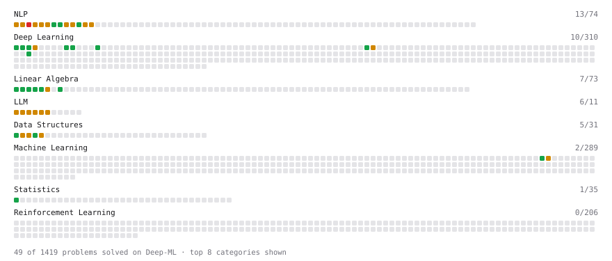

# Deep-ML

My machine learning practice from [Deep-ML](https://www.deep-ml.com). Every solution here was written by hand.

**30** solved · 30 problems · 0 labs · 0 math

[**Browse the interactive portfolio**](https://Hasakij.github.io/deep-ml/) to replay this filling in over time.

## Problems

| | Difficulty | Solved | |
| --- | --- | --- | --- |
| [Calculate 2x2 Matrix Inverse](https://www.deep-ml.com/problems/8) | easy | 2025-12-15 | [solution](problems/0008-calculate-2x2-matrix-inverse) |
| [Calculate Covariance Matrix](https://www.deep-ml.com/problems/10) | easy | 2025-12-15 | [solution](problems/0010-calculate-covariance-matrix) |
| [Calculate Mean by Row or Column](https://www.deep-ml.com/problems/4) | easy | 2025-12-15 | [solution](problems/0004-calculate-mean-by-row-or-column) |
| [Calculate Perplexity for Language Models](https://www.deep-ml.com/problems/320) | easy | 2026-01-13 | [solution](problems/0320-calculate-perplexity-for-language-models) |
| [Calculate Unigram Probability from Corpus](https://www.deep-ml.com/problems/129) | easy | 2025-12-19 | [solution](problems/0129-calculate-unigram-probability-from-corpus) |
| [Exact Match Score with Normalization](https://www.deep-ml.com/problems/325) | easy | 2026-01-13 | [solution](problems/0325-exact-match-score-with-normalization) |
| [Label Encoding for Ordinal Variables](https://www.deep-ml.com/problems/356) | easy | 2026-02-06 | [solution](problems/0356-label-encoding-for-ordinal-variables) |
| [Matrix-Vector Dot Product](https://www.deep-ml.com/problems/1) | easy | 2025-07-17 | [solution](problems/0001-matrix-vector-dot-product) |
| [Min-Max Scaling of Feature Values](https://www.deep-ml.com/problems/112) | easy | 2026-02-06 | [solution](problems/0112-min-max-scaling-of-feature-values) |
| [Reshape Matrix](https://www.deep-ml.com/problems/3) | easy | 2025-12-15 | [solution](problems/0003-reshape-matrix) |
| [Scalar Multiplication of a Matrix](https://www.deep-ml.com/problems/5) | easy | 2025-12-15 | [solution](problems/0005-scalar-multiplication-of-a-matrix) |
| [Transpose of a Matrix](https://www.deep-ml.com/problems/2) | easy | 2025-07-22 | [solution](problems/0002-transpose-of-a-matrix) |
| [BLEU Score for Text Generation](https://www.deep-ml.com/problems/321) | medium | 2026-01-27 | [solution](problems/0321-bleu-score-for-text-generation) |
| [BM25 Ranking ](https://www.deep-ml.com/problems/90) | medium | 2026-01-30 | [solution](problems/0090-bm25-ranking) |
| [Boxed Answer Extraction for Math Benchmarks](https://www.deep-ml.com/problems/318) | medium | 2026-02-05 | [solution](problems/0318-boxed-answer-extraction-for-math-benchmarks) |
| [Bradley-Terry Model for Pairwise Rankings](https://www.deep-ml.com/problems/322) | medium | 2026-01-30 | [solution](problems/0322-bradley-terry-model-for-pairwise-rankings) |
| [Calculate Eigenvalues of a Matrix](https://www.deep-ml.com/problems/6) | medium | 2026-01-27 | [solution](problems/0006-calculate-eigenvalues-of-a-matrix) |
| [Code Execution Verifier for Programming Benchmarks](https://www.deep-ml.com/problems/324) | medium | 2026-02-06 | [solution](problems/0324-code-execution-verifier-for-programming-benchmarks) |
| [Compute Pointwise Mutual Information](https://www.deep-ml.com/problems/111) | medium | 2026-01-26 | [solution](problems/0111-compute-pointwise-mutual-information) |
| [Evaluate Translation Quality with METEOR Score](https://www.deep-ml.com/problems/110) | medium | 2026-01-26 | [solution](problems/0110-evaluate-translation-quality-with-meteor-score) |
| [Handle Missing Data with Imputation](https://www.deep-ml.com/problems/354) | medium | 2026-02-06 | [solution](problems/0354-handle-missing-data-with-imputation) |
| [Implement TF-IDF (Term Frequency-Inverse Document Frequency)](https://www.deep-ml.com/problems/60) | medium | 2026-01-29 | [solution](problems/0060-implement-tf-idf-term-frequency-inverse-document-frequency) |
| [Math Answer Verification with Equivalence Checking](https://www.deep-ml.com/problems/319) | medium | 2026-02-05 | [solution](problems/0319-math-answer-verification-with-equivalence-checking) |
| [MMLU Letter-Matching Evaluation](https://www.deep-ml.com/problems/326) | medium | 2026-01-30 | [solution](problems/0326-mmlu-letter-matching-evaluation) |
| [MMLU Log-Probability Scoring](https://www.deep-ml.com/problems/316) | medium | 2026-02-04 | [solution](problems/0316-mmlu-log-probability-scoring) |
| [Optimal String Alignment Distance](https://www.deep-ml.com/problems/51) | medium | 2026-01-27 | [solution](problems/0051-optimal-string-alignment-distance) |
| [Outlier Detection and Removal Using IQR Method](https://www.deep-ml.com/problems/355) | medium | 2026-02-11 | [solution](problems/0355-outlier-detection-and-removal-using-iqr-method) |
| [Pairwise Preference Judge for LLM Comparison](https://www.deep-ml.com/problems/323) | medium | 2026-02-05 | [solution](problems/0323-pairwise-preference-judge-for-llm-comparison) |
| [Rubric-Based LLM Judge Evaluation](https://www.deep-ml.com/problems/317) | medium | 2026-02-04 | [solution](problems/0317-rubric-based-llm-judge-evaluation) |
| [GPT-2 Text Generation](https://www.deep-ml.com/problems/88) | hard | 2026-02-09 | [solution](problems/0088-gpt-2-text-generation) |

---

_This file is regenerated by Deep-ML on every push._
